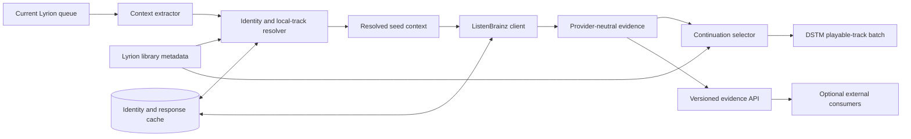

# BrainzMix design

## Document status

This is an early design proposal, not documentation for a shipped plugin. It
defines the desired product boundary, records relevant existing work, and
provides a basis for deciding whether BrainzMix should be implemented as a new
plugin, extracted collaboratively from an existing plugin, or pursued through
upstream contributions.

No collaboration or code-sharing arrangement with the projects discussed
below has yet been agreed.

The initial prior-art and repository assessment was performed on 2026-07-20.

## Purpose

BrainzMix would contribute ListenBrainz-powered candidate tracks to Lyrion's
**Don't Stop The Music** (DSTM) system. It has one focused selection concept:
continue from the current musical context using similar-recording and
similar-artist evidence.

The plugin should prefer playable copies already present in the Lyrion library.
Streaming-service resolution may be added through optional adapters, but local
libraries are the baseline.

The DSTM handler is one consumer of a documented evidence service. Other
consumers, including a playlist optimizer, need the same structured
ListenBrainz relationships without player state or an already selected batch.
This prevents them from depending on private Perl modules or misusing the
queue-oriented DSTM callback as a general similarity API.

## Hard requirement: no tagged MBIDs

BrainzMix must work with a Lyrion library containing **zero MusicBrainz
identifiers in its file metadata**. Users must not be required to retag their
collections, install Picard, or rescan after adding MBIDs before BrainzMix can
continue playback.

MBIDs remain valuable internal identities. BrainzMix may resolve and cache them
from ordinary metadata, but the distinction is fundamental:

> MBIDs are an internal enrichment and interoperability mechanism, not an
> admission requirement for the user's library.

“Works without tagged MBIDs” does not promise that every recording can always
be identified exactly. Incomplete metadata, ambiguous titles, distinct live or
remixed recordings, and gaps in MusicBrainz are unavoidable. It means that the
plugin continues through lower-granularity or non-MBID strategies instead of
refusing to operate.

## Existing landscape and prior art

### Lyrion core

Lyrion's current DSTM plugin has an explicit provider mechanism:
`registerHandler(token, callback)`. A provider callback receives the player
and returns playable tracks asynchronously. This is the proper integration
surface for BrainzMix's continuation source.

Lyrion also contains a ListenBrainz implementation under its AudioScrobbler
plugin. It submits now-playing and completed-listen events and validates
ListenBrainz tokens. It does not currently provide a core similar-recording,
similar-artist, or reusable similarity-evidence service.

### ListenBrainz Fresh Releases

[SimonArnold002/LMS-ListenBrainz-New-Releases](https://github.com/SimonArnold002/LMS-ListenBrainz-New-Releases)
is substantial, recent prior art. It already combines ListenBrainz browsing,
DSTM contribution, identity resolution, and local-library matching.

Its implementation already demonstrates several important behaviors:

- registration through the Lyrion DSTM provider mechanism;
- artist-name-to-MBID resolution when the current track lacks an artist MBID;
- exact local recording-MBID lookup followed by normalized artist/title
  matching;
- local-library-first selection with optional streaming fallback;
- artist diversity and session no-repeat state;
- ListenBrainz caching and failure fallbacks; and
- an optional Last.fm similar-artist fallback.

That is partial overlap, not the intended BrainzMix contract. BrainzMix makes
recording-level and artist-level similarity explicit, preserves both evidence
paths, and exposes them through a supported service reusable outside DSTM.

The project is MIT licensed and actively developed at the time of this design.
It is installable through its own plugin repository. It was not found in
Lyrion's central plugin registry during the initial assessment.

The existing code exposes internal `API.pm`, `Browse.pm`, and `DSTM.pm`
modules, but no documented, versioned bulk similarity-evidence API was identified.
The DSTM callback returns playable URLs and therefore cannot preserve the
provenance, ranks, confidence, and endpoint-local structure required by a
general evidence consumer.

### Relationship decision

Before implementing BrainzMix, discuss the overlap with the ListenBrainz Fresh
Releases maintainer. Three outcomes are legitimate:

1. **Contribute upstream.** Improve its DSTM and expose a supported provider
   API there.
2. **Collaborative extraction.** Move or share the focused mixing capability
   through a separately maintained BrainzMix plugin, with attribution and a
   migration plan.
3. **Independent implementation.** Proceed only when the intended product
   boundary or engineering requirements differ enough to justify duplication.

The design must not assume the second outcome without the author's agreement.
MIT licensing permits reuse under its terms, but licence permission is not a
substitute for healthy ecosystem coordination.

## Goals

- Keep music playing through native Lyrion DSTM integration.
- Work with ordinary artist, title, album, duration, track-number, and year
  metadata.
- Prefer local Lyrion tracks and return only unambiguous playable identities.
- Use ListenBrainz similar-recording and similar-artist data without making
  remote availability a playback-critical dependency.
- Distinguish exact, strong, probable, weak, and ambiguous identity matches.
- Avoid repeating tracks and provide configurable artist/album variety.
- Cache resolved identities and provider responses responsibly.
- Remain practical on Raspberry Pi and similar low-power Lyrion systems.
- Offer an optional stable service contract for other Lyrion plugins.
- Keep private tokens, complete queues, and library paths out of routine logs.

## Non-goals

- Requiring MusicBrainz-aware tagging.
- Writing resolved MBIDs back into audio files.
- Replacing Lyrion's AudioScrobbler or becoming the canonical scrobbling owner.
- Replacing Bliss or another acoustic-analysis engine.
- Providing broad ListenBrainz browsing, personalized feeds, or unrelated
  discovery experiences.
- Treating ListenBrainz popularity or collaborative similarity as acoustic
  transition quality.
- Guaranteeing an exact recording match from insufficient metadata.
- Making streaming-service plugins mandatory.
- Making a similarity-evidence consumer depend on active player or queue state.

## User experience

### DSTM selection

When BrainzMix and DSTM are enabled, the player's DSTM selector gains one
source: **BrainzMix similarity**. It contributes locally playable tracks
supported by similar-recording or similar-artist evidence for the recent queue
context.

BrainzMix should not add an Applications entry merely to duplicate that
selection. An Applications surface is justified only if it later offers useful
diagnostics, preview, or history beyond the existing DSTM settings.

### Settings

A mandatory `Settings.pm` should provide:

- optional ListenBrainz user token, stored as a secret when required by an
  enabled endpoint;
- local-library-only or local-first-with-streaming policy;
- enabled streaming adapters and their priority, if implemented;
- batch size;
- artist and album diversity/cooldown;
- explicit-content policy where reliable metadata exists;
- cache status and a clear-cache action;
- identity-resolution coverage; and
- provider health and last successful contact.

The plugin may reuse a token already configured for Lyrion scrobbling only
through a supported Lyrion interface and explicit user consent. It must not
reach into another plugin's private preferences. Until such an interface
exists, BrainzMix owns its token setting.

### Degraded operation

The UI should distinguish:

- ready;
- ready with incomplete identity coverage;
- cached/offline;
- ListenBrainz unavailable;
- authentication required;
- no playable local matches; and
- fallback provider active.

A remote failure should not stop an already playing queue. If BrainzMix cannot
return a safe continuation, it returns an empty batch and allows DSTM's normal
fallback behavior rather than inventing weak matches.

## Architecture



Suggested module ownership:

```text
Plugins/BrainzMix/
  Plugin.pm
  Settings.pm
  DSTM.pm
  ListenBrainzClient.pm
  MusicBrainzResolver.pm
  LocalTrackResolver.pm
  IdentityCache.pm
  Continuation.pm
  EvidenceService.pm
  Commands.pm
  strings.txt
```

`DSTM.pm` owns queue-oriented registration and callbacks.
`EvidenceService.pm` owns provider-neutral bulk evidence. Neither should call
the other as a shortcut; both consume the lower-level clients and resolvers.

## Identity resolution

### Seed resolution

For a current or recent queue track, capture:

- embedded recording and artist MBIDs, if present;
- credited artist and album artist;
- title and album;
- duration;
- track number, disc number, and year where available;
- local LMS track identity and URL; and
- source type, such as local file or streaming track.

Resolve progressively:

1. validate and use embedded MBIDs;
2. use ListenBrainz's documented
   [`GET/POST /1/metadata/lookup/`](https://listenbrainz.readthedocs.io/en/latest/users/api/metadata.html)
   operation with artist, recording, and optional release names;
3. use the
   [MusicBrainz recording search API](https://musicbrainz.org/doc/MusicBrainz_API/Search)
   with artist, title, release, and duration;
4. resolve only the artist when a recording match is not sufficiently strong;
5. use artist-level similarity when recording-level identity is unavailable;
   and
6. return no BrainzMix batch when neither recording nor artist context can be
   resolved safely.

Network resolution must be asynchronous and cached. MusicBrainz requests must
use a meaningful User-Agent and obey its published rate limits. A configured
compatible mirror may be supported, but it must be validated and reported.

### Internal identity cache

The cache should associate a local LMS identity with:

```text
local track URL or durable LMS identity
metadata fingerprint
resolved recording MBID
resolved artist MBID list
resolution method
confidence
candidate alternatives or ambiguity marker
resolution timestamp
resolver/data version
```

The fingerprint contains the normalized metadata fields used for resolution.
When those fields change, the cached identity is stale. Playlist database IDs
alone are not durable identities across rescans.

Do not write resolved identifiers into the user's files. Exporting suggested
tag improvements may be a separate future feature, never an automatic side
effect of playback.

### Confidence policy

| Level | Meaning | Permitted use |
| --- | --- | --- |
| **Exact** | Valid embedded recording MBID or another stable exact identifier. | Recording-level evidence and exact local lookup. |
| **Strong** | Unique artist, title, release, and compatible duration match. | Recording-level selection. |
| **Probable** | Unique normalized artist/title with corroborating duration or release evidence. | Recording-level selection with reported confidence. |
| **Weak** | Artist/title only, or artist resolution without recording identity. | Artist-level discovery; avoid asserting an exact recording. |
| **Ambiguous** | Multiple plausible recordings or local tracks remain. | Reject automatic recording selection. |

Thresholds must be conservative. “First search result” is not an identity
policy.

### Candidate-to-library resolution

ListenBrainz similarity results commonly identify recordings by MBID. BrainzMix
must map them to playable local tracks even when local files have no MBID tags:

1. exact lookup against any MBIDs already present or cached;
2. batch-fetch unresolved candidate metadata through ListenBrainz's documented
   [`GET/POST /1/metadata/recording/`](https://listenbrainz.readthedocs.io/en/latest/users/api/metadata.html)
   operation;
3. search Lyrion using normalized artist and title;
4. disambiguate with album, duration, year, and version qualifiers;
5. reject remaining ambiguity; and
6. optionally try enabled streaming adapters.

Text normalization should handle Unicode, diacritics, credited-artist join
phrases, punctuation, and common edition suffixes. It must not collapse
meaningful distinctions such as live, remix, acoustic, instrumental, or
explicitly different recordings merely to increase the match count.

## ListenBrainz similarity evidence and API feasibility

BrainzMix deliberately combines two different ListenBrainz relationships. In
user-facing language, “similar songs” maps to recording-level similarity:

| Evidence operation | Required seed | Candidate contribution | Feasibility evidence |
| --- | --- | --- | --- |
| **Get similar recordings** | A confidently resolved recording MBID | Directly related recording candidates; this is the most track-specific path. | The official dataset hoster provides a [Similar Recordings Viewer](https://labs.api.listenbrainz.org/similar-recordings) and [JSON endpoint](https://labs.api.listenbrainz.org/similar-recordings/json), using `recording_mbids` and `algorithm` parameters. |
| **Get similar artists** | A confidently resolved artist MBID | Related artists whose recordings form a broader candidate pool. | The official dataset hoster provides a [Similar Artists Viewer](https://labs.api.listenbrainz.org/similar-artists) and [JSON endpoint](https://labs.api.listenbrainz.org/similar-artists/json), using `artist_mbids` and `algorithm` parameters. |
| **Expand an artist to recordings** | A seed or similar artist MBID | Converts artist evidence into recording candidates; popularity or catalog membership is not itself a similarity score. | ListenBrainz documents [`GET /1/popularity/top-recordings-for-artist/{artist_mbid}`](https://listenbrainz.readthedocs.io/en/latest/users/api/popularity.html); the [MusicBrainz browse API](https://musicbrainz.org/doc/MusicBrainz_API#Browse) can instead enumerate recordings linked to an artist. |
| **Fetch recording metadata** | Candidate recording MBIDs | Supplies artist credits, titles, releases, and other fields needed for local-library matching. | ListenBrainz documents bulk-capable [`GET/POST /1/metadata/recording/`](https://listenbrainz.readthedocs.io/en/latest/users/api/metadata.html). |
| **Fetch artist metadata** | Candidate artist MBIDs | Supplies canonical names and aliases for matching and explanation. | ListenBrainz documents [`GET /1/metadata/artist/`](https://listenbrainz.readthedocs.io/en/latest/users/api/metadata.html). |

Recording and artist evidence are requested independently when both identities
are available. If recording identity cannot be established from an untagged
track, artist similarity still provides a useful path. If only the recording
path is available, BrainzMix does not require artist expansion.

Each relationship retains its source seed, ListenBrainz endpoint or dataset,
raw rank or score, fetch time, and cache state. The capability API reports
similar-recording, similar-artist, and artist-recording availability
independently because these services may not have identical operational or
stability characteristics.

The ListenBrainz dataset hoster currently exposes several algorithms for each
similarity dataset. BrainzMix must pin and report the chosen algorithm
identifiers rather than silently following a changing default. Algorithm
selection should remain an evaluated implementation policy before it becomes a
user-facing setting.

The two similarity operations are exposed by the official **Labs dataset
hoster**, not by the versioned core API documentation. This demonstrates that
the required data exists and is queryable, but not that the interface has the
same stability contract as a production core endpoint. Phase 0 must verify the
JSON request/response shapes, authentication requirements, batch limits,
licensing, availability, and change policy. BrainzMix's provider abstraction
and capability reporting are therefore feasibility requirements, not optional
indirection.

## DSTM candidate contribution

The default seed is the most recent usable musical item at or before the
playing position, not blindly the final queued URL. This keeps behavior
responsive after skips or manual queue changes.

The single BrainzMix DSTM handler:

1. captures one or more recent musical context tracks;
2. resolves recording and artist identities independently;
3. obtains similar recordings and similar artists;
4. expands similar artists into candidate recordings;
5. resolves candidates to playable local tracks;
6. removes queued, recently played, and ambiguous matches;
7. fuses and ranks the retained evidence;
8. applies artist and album diversity; and
9. returns a bounded playable batch to DSTM.

### Evidence fusion

Prefer evidence tiers in this order:

1. a recording supported by recording similarity whose artist is also
   supported by artist similarity;
2. a recording supported directly by recording similarity; and
3. a recording contributed through a similar artist.

Support from several recent context tracks strengthens a candidate within its
tier. Within-source rank can order candidates further, but raw scores from the
recording and artist datasets must not be treated as a shared numeric scale.
Every selected track retains all contributing paths so a DSTM decision or API
consumer can explain whether song similarity, artist similarity, or both
supported it.

Evolution must be bounded. Newly inserted tracks may influence the next DSTM
top-up, but they must not cause uncontrolled semantic drift or erase the
listener's recent context immediately.

### Repeats and diversity

At minimum, enforce:

- no duplicate playable URL in the returned batch;
- no duplicate against the current queue;
- a bounded session track no-repeat set;
- configurable artist cooldown; and
- optional album cooldown.

If a constraint leaves no feasible result, relaxation must be ordered and
reported. Track identity ambiguity is never relaxed.

## Public evidence service

### Why DSTM is not the API

The Lyrion DSTM handler is intentionally narrow: it produces playable URLs for
a player when its queue approaches the end. A playlist optimizer or another
similarity consumer needs different information:

- source recording and artist identities;
- endpoint-local relationships;
- raw provider rank or score;
- provider and dataset provenance;
- identity confidence;
- cache age and availability state; and
- candidates that may not yet have been selected or resolved to playback URLs.

Calling BrainzMix's DSTM handler would discard this structure and introduce an
unnecessary dependency on player state. The service API must therefore be a
separate contract over shared lower-level code.

The planned `bliss-em-all` integration is one intended consumer. It can use
BrainzMix evidence to construct a semantically supported candidate pool, then
apply its own Bliss-based acoustic scoring and route constraints. BrainzMix
does not select playlist bridges on its behalf.

### Initial command concepts

The precise Lyrion command syntax needs prototyping, but the capability should
be bulk-oriented and versioned:

```text
brainzmix capabilities
brainzmix resolve
brainzmix similarity_evidence
```

`capabilities` reports the API version, supported evidence types, enabled
providers, authentication and cache state, supported inputs, and bounded
request limits.

`resolve` accepts ordinary metadata or MBIDs and returns zero or more identity
candidates with confidence and ambiguity status.

`similarity_evidence` accepts a batch of recording/artist contexts and returns
provider-neutral evidence. It does not choose a bridge, order a playlist, or
modify a queue.

An in-process Perl facade may wrap the same service for efficiency, but only
after its callback shape and compatibility policy are documented. Consumers
must never be told to call arbitrary methods from `ListenBrainzClient.pm`.

### Evidence model

Each evidence item records its source and candidate identities, relationship,
provider, dataset, raw score or rank, identity confidence, cache state, and
observation time. Raw scores from different endpoints or providers are not
inherently comparable. BrainzMix preserves them and their provenance; a
consumer chooses a documented tier or rank-fusion policy.

The service supports frozen snapshots: selected candidate tracks do not
recursively become new query seeds within the same request unless the consumer
explicitly begins a new request.

### Compatibility

- Version the result schema independently of the plugin release.
- Additive fields are permitted within a major API version.
- Removing or redefining a field requires a new major version.
- `capabilities` is the source of truth; consumers do not infer support from a
  plugin version string.
- Disabled providers and missing authentication are capability states, not
  malformed empty successes.
- A consumer must remain functional when BrainzMix is absent.

## Provider, cache, and failure policy

ListenBrainz and MusicBrainz calls should use short timeouts, bounded
concurrency, rate-limit handling, idempotent transient retries, circuit
breakers, schema validation, and positive and negative caching.

Cache entries include provider, endpoint, input identity or fingerprint,
normalization version, response or dataset version where available, and lookup
time. A schema or resolver-policy change must not silently reuse an
incompatible result.

Provider states are disabled, fresh, cached, stale, partial, rate-limited,
unavailable, and failed. Network waits and large library searches must remain
asynchronous and must not block Lyrion's main event loop.

### Offline behavior

- Continue from a usable cached similarity candidate pool when permitted.
- Mark stale evidence rather than presenting it as fresh.
- Prefer safe local matches already resolved.
- Return an empty DSTM batch when no safe cached path remains.
- Do not convert an Internet outage into repeated aggressive retries.

## Security, privacy, and observability

- Store tokens through Lyrion preferences and never return them through CLI,
  JSON-RPC, reports, or logs.
- Redact authorization headers and provider payloads.
- Do not log complete queues, candidate lists, private paths, or library
  contents at INFO.
- Use Lyrion's normal logging category and settings UI.
- DEBUG may include sanitized identities, confidence, counts, timings, and
  fallback decisions.
- Avoid sending more metadata to remote services than the operation requires.

Each DSTM top-up should expose its context size, seed-resolution methods and
confidence, available similarity paths, provider/cache state, candidate and
rejection counts, fallback path, and stage timings. Rejection counts should
distinguish ambiguity, duplicates, cooldowns, and absence from the local
library. The evidence service additionally reports provenance and cache age per
evidence group.

## Evaluation and acceptance

### Mandatory zero-MBID fixture

The primary integration fixture contains no embedded recording or artist
MBIDs. It includes ordinary metadata, duplicate titles, compilation credits,
featured artists, accented and non-Latin names, studio/live/remix/remastered
variants, incomplete albums, missing optional fields, and intentionally
ambiguous candidates.

Acceptance requires that BrainzMix:

1. starts the similarity-based DSTM source without retagging;
2. resolves usable seed context from ordinary metadata;
3. returns only playable local URLs in local-only mode;
4. does not silently choose ambiguous local recordings;
5. exposes resolution confidence and coverage;
6. preserves the queue and returns an empty batch on unrecoverable failure; and
7. performs acceptably on the target Raspberry Pi class.

### Identity and mix evaluation

Measure resolution coverage by confidence, manually verified precision,
ambiguity rejection, cache hit rate, cold/warm latency, network calls, local
library utilization, repeat behavior, artist and album variety, and semantic
drift across top-ups.

Compare with Lyrion RandomPlay, the existing ListenBrainz Fresh Releases DSTM
contribution, and LastMix where available. Assess relevance, variety,
continuity, and subjective listening quality separately. Collaborative
evidence is not an acoustic transition score, so listening review remains
essential.

Run ablations for similar recordings only, similar artists only, and their
fusion. Report endpoint coverage, local resolution, overlap between the two
candidate pools, and the provenance tier of every selected track.

The public API also needs deterministic schema fixtures, bulk/single parity,
capability negotiation, provider-disabled and authentication-missing cases,
partial/stale/rate-limited/malformed/offline responses, frozen snapshots,
Unicode and ambiguity serialization, and compatibility tests per major version.

## Implementation relationship scenarios

### Scenario A: upstream contribution

ListenBrainz Fresh Releases remains the implementation owner. Work documents
and strengthens its DSTM behavior, identity confidence, zero-MBID tests, and
Raspberry Pi performance, and adds a supported evidence service. This minimizes
duplication but retains a broad plugin boundary.

### Scenario B: collaborative extraction

BrainzMix becomes the focused owner of ListenBrainz mixing, identity
resolution, and evidence services. ListenBrainz Fresh Releases depends on or
optionally integrates with it, with an agreed handler migration. This produces
the clearest boundary but introduces cross-plugin release coordination and
dependency UX. It requires the existing author's participation.

### Scenario C: independent plugin

BrainzMix implements its own clients and resolvers and uses unique preferences,
logging, commands, and DSTM handler identifiers. This is justified only by
materially different requirements or an inability to establish a maintainable
shared direction. It has the highest duplication and user-confusion cost.

## Proposed phased work

### Phase 0: collaboration and evidence

- Share this design with the ListenBrainz Fresh Releases maintainer.
- Confirm the intended maintenance and scope of its DSTM implementation.
- Ask whether a focused extraction or supported evidence API is desirable.
- Review its behavior using the mandatory zero-MBID fixture.
- Decide among scenarios A, B, and C before copying or implementing code.

### Phase 1: identity prototype

- Build sanitized local-library fixtures.
- Prototype textual seed and similarity-candidate-to-library resolution.
- Define confidence and ambiguity rules.
- Measure coverage and cold/warm latency.
- Validate rate-limited asynchronous operation on Raspberry Pi.

### Phase 2: minimum DSTM plugin

- Add `Plugin.pm`, mandatory `Settings.pm`, logging, and localization.
- Register one BrainzMix similarity handler.
- Implement local-only operation, caches, repeats, and diversity.
- Add provider and offline failure behavior.
- Package and test on supported Lyrion versions.

### Phase 3: service API

- Add versioned capabilities.
- Add bulk resolution and similarity-evidence commands.
- Publish fixtures and compatibility tests.
- Integrate one optional consumer without coupling it to DSTM or private
  modules.

### Phase 4: optional expansion

- Streaming adapters.
- Preview and diagnostics UI.
- Exportable identity-resolution suggestions.
- Additional semantic providers behind the evidence model.

## Open questions

1. Which relationship scenario will the existing plugin maintainer support?
2. Should the first release be local-only or include streaming adapters?
3. Can Lyrion expose configured ListenBrainz credentials through a supported,
   consent-aware interface?
4. Should textual resolution prefer ListenBrainz metadata lookup, MusicBrainz
   search, or a calibrated combination?
5. Which duration and release tolerances distinguish remasters from genuinely
   different recordings?
6. How should multi-artist credits map to artist-similarity seeds?
7. What cache lifetime fits identities versus evolving similarity datasets?
8. Should a compatible local MusicBrainz mirror be detected or configured?
9. Which evidence APIs belong in BrainzMix rather than a general Lyrion
   semantic-provider contract?
10. What identity precision and Raspberry Pi latency are release gates?

## References

- [ListenBrainz Fresh Releases repository](https://github.com/SimonArnold002/LMS-ListenBrainz-New-Releases)
- [Existing ListenBrainz DSTM implementation](https://github.com/SimonArnold002/LMS-ListenBrainz-New-Releases/blob/main/ListenBrainzFreshReleases/DSTM.pm)
- [Existing local-library matching implementation](https://github.com/SimonArnold002/LMS-ListenBrainz-New-Releases/blob/main/ListenBrainzFreshReleases/Browse.pm)
- [Lyrion DSTM provider implementation](https://github.com/LMS-Community/slimserver/blob/public/9.2/Slim/Plugin/DontStopTheMusic/Plugin.pm)
- [Lyrion ListenBrainz scrobbling implementation](https://github.com/LMS-Community/slimserver/blob/public/9.2/Slim/Plugin/AudioScrobbler/API/ListenBrainz.pm)
- [ListenBrainz API](https://listenbrainz.readthedocs.io/en/latest/users/api/)
- [ListenBrainz metadata API: identity lookup and recording/artist metadata](https://listenbrainz.readthedocs.io/en/latest/users/api/metadata.html)
- [ListenBrainz popularity API: top recordings for an artist](https://listenbrainz.readthedocs.io/en/latest/users/api/popularity.html)
- [ListenBrainz similar-recordings dataset](https://labs.api.listenbrainz.org/similar-recordings)
- [ListenBrainz similar-artists dataset](https://labs.api.listenbrainz.org/similar-artists)
- [MusicBrainz web service](https://musicbrainz.org/doc/MusicBrainz_API)
- [MusicBrainz search API](https://musicbrainz.org/doc/MusicBrainz_API/Search)
